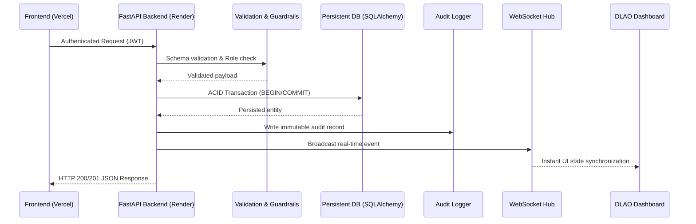

# System Architecture: Digital Legal Aid System (DLAS)

## 1. Architectural Philosophy & Deployment Topology
The Digital Legal Aid System (DLAS) operates on a strictly decoupled, high-integrity architecture designed for public legal aid in Bangladesh:
- **Frontend Layer (Vercel)**: Next.js/React or static SPA providing low-latency, mobile-responsive UI in Bangla and English. The frontend is strictly a presentation and interaction layer. It has **zero direct access** to data stores and **zero direct AI/telephony credentials**.
- **Backend Service Layer (Render-compatible FastAPI)**: Python 3.12+ FastAPI application serving REST endpoints, WebSocket hubs, authentication, business logic validation, state machines, and integrations.
- **Authoritative Data Layer (Persistent SQL Database)**: PostgreSQL on Render in production, SQLite locally. The database is the **single source of truth**. No client or cache may represent authoritative state.
- **AI Integration (Google Gemini)**: Backend-mediated conversational intake, summary extraction, and eligibility categorization. Gemini is purely an **advisory assistant** and never mutates case states to verified/assigned.
- **Telephony & IVR (Twilio Voice)**: Backend webhook endpoints handling inbound IVR calls, recording intake audio, and dispatching speech streams.

## 2. Inviolable Mutation Flow
Every state modification in DLAS must strictly traverse the following unidirectional pipeline:


## 3. Case Lifecycle State Machine
```text
[NEW]
  │
  ▼
[AI_INTAKE]
  │
  ▼
[PENDING_HUMAN_REVIEW] ──────────┐
  │                 │            │
  │ (DLAO Verifies) │ (Needs Info)│ (Rejects)
  ▼                 ▼            ▼
[VERIFIED]  [NEEDS_INFO]    [REJECTED]
  │
  ▼
[PANEL_LAWYER_QUEUE]
  │ (DLAO Assigns)
  ▼
[LAWYER_REVIEW]
  │
  ▼
[CLOSED / RESOLVED]
```
- **Mandatory Human Gate**: Transition from `PENDING_HUMAN_REVIEW` to `VERIFIED` or `PANEL_LAWYER_QUEUE` requires explicit human DLAO (District Legal Aid Officer) verification.
- **AI Invariant**: Automated systems (Gemini, voice agents, web intake) can ONLY move a case from `NEW` to `AI_INTAKE` to `PENDING_HUMAN_REVIEW`. They must **NEVER** verify, reject, assign, or delete cases.

## 4. Failure Handling & Circuit Breakers
1. **Database Downtime**: Return `503 Service Unavailable` with clean bilingual message. Never leave open transactions.
2. **WebSocket Disconnects**: Frontend must implement exponential backoff reconnection (1s, 2s, 5s, 10s, max 30s) and perform a fresh REST state fetch upon reconnection.
3. **AI Service Outage**: If Gemini API returns 429/500 or times out, intake cases must gracefully fallback to raw text capture with status `PENDING_HUMAN_REVIEW` flagged as `manual_extraction_required`.
4. **Telephony Failures**: Twilio webhooks must respond with TwiML fallback within 10 seconds to avoid call dropping.
