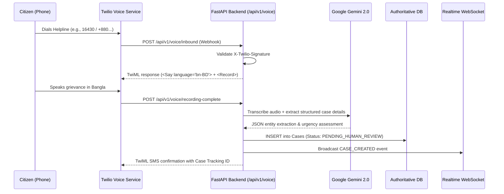

# Twilio & Gemini Voice Intake Integration

## 1. Architectural Overview & Workflow
The voice intake pipeline allows citizens without smartphone access or literacy to initiate a legal aid request via phone:

## 2. Twilio Webhook Security Standards
- **Signature Verification**: Every incoming request to `/api/v1/voice/*` must be verified using Twilio's request validator with `TWILIO_AUTH_TOKEN` and the exact public request URL.
- **Credential Storage**: `TWILIO_ACCOUNT_SID` and `TWILIO_AUTH_TOKEN` are backend-only environment variables and never logged or serialized into client responses.

## 3. Gemini Audio Extraction Guidelines
- **Language Model**: Google Gemini 2.0 Flash (`gemini-2.0-flash`).
- **Prompt Engineering**:
  - Direct the model to understand Bangladeshi regional dialects (e.g., Chittagonian, Sylheti, Noakhali, standard colloquial Bangla).
  - Explicit instruction to extract:
    1. Caller Name
    2. Approximate location (District, Upazila)
    3. Adverse party details (if applicable)
    4. Primary issue (Land dispute, domestic violence, wrongful termination, money recovery)
    5. Self-reported economic distress indicator
    6. Language summary in both Bangla and English
- **Strict Output Schema**: Model must return structured JSON validating against Pydantic schema `VoiceIntakeExtraction`.

## 4. Resilience & Fallback Protections
1. **Gemini Latency or Rate Limit (429/503)**:
   - If Gemini is unreachable, the backend stores the raw audio recording URL in `case.audio_recording_url`.
   - The case is created with `status: PENDING_HUMAN_REVIEW` and `transcription_status: "MANUAL_TRANSCRIPTION_REQUIRED"`.
   - The caller is never hung up on without receiving an SMS case tracking number.
2. **Poor Audio Quality / Inaudible Voice**:
   - TwiML prompt invites the caller to speak clearly. If recording is under 3 seconds or silent, play automated Bangla guidance: *"আপনার কথা স্পষ্ট শোনা যায়নি। দয়া করে আবার চেষ্টা করুন অথবা আপনার নিকটস্থ জেলা লিগ্যাল এইড অফিসে যোগাযোগ করুন।"*
3. **Emergency Detection**:
   - If caller mentions imminent physical harm or acute violence, Gemini flags `urgency: EMERGENCY` immediately, triggering priority broadcast on DLAO dashboards.
