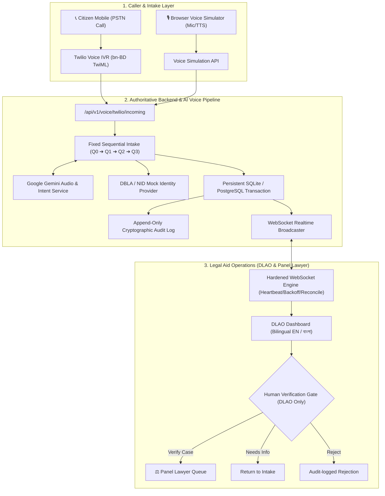

# ⚖️ Digital Legal Aid System (DLAS) — বাংলাদেশ ডিজিটাল আইনি সহায়তা ব্যবস্থা

[](https://fastapi.tiangolo.com)
[](https://python.org)
[](https://developer.mozilla.org)
[](https://websockets.spec.whatwg.org)
[](https://www.twilio.com/voice)
[](https://ai.google.dev)
[](LICENSE)

An authoritative, secure, and production-grade digital legal-aid intake and case management platform inspired by the **National Legal Aid Services Organization (NLASO / জাতীয় আইনগত সহায়তা প্রদান সংস্থা)** and the **DBLA Online Legal Aid Application** standards.

DLAS bridges the gap between underprivileged citizens and statutory legal support through a **natural Bangladesh Bangla (`bn-BD`) voice telephony intake pipeline**, authoritative state machines, strict human-in-the-loop verification gates, and a realtime bilingual legal officer dashboard.

---

## 🏛️ System Architecture



---

## ✨ Key Architectural Principles

1. **Authoritative Backend Source of Truth**:
   - The frontend never mutates application state directly. Every mutation follows:
     `Frontend Action ➔ API Validation ➔ Persistent DB Transaction ➔ Audit Log ➔ Realtime Event Broadcast ➔ Optimistic UI Reconciliation`.
2. **Strict Human-in-the-Loop Verification Gate**:
   - Google Gemini **never** verifies, approves, rejects, assigns, or deletes legal aid cases.
   - AI serves exclusively as a supportive transcription, legal categorization, and urgent risk flagging assistant.
   - Only an authenticated District Legal Aid Officer (DLAO) can verify a case and dispatch it to the Panel Lawyer Queue.
3. **Bangla-First Voice Intake Pipeline**:
   - Native Bangladesh Bangla (`bn-BD`) speech synthesis and prompt framing.
   - Spoken responses strictly adhere to a backend-governed 4-stage statutory protocol:
     - **Q0 (Consent)**: Explicit consent to discuss the grievance.
     - **Q1 (Incident)**: Grievance summary and civil/criminal categorization.
     - **Q2 (Danger & Safety)**: Detection of immediate violence or threats.
     - **Q3 (Child & Vulnerability)**: Safe callback confirmation and child welfare risks.
   - Incremental per-turn database persistence (zero data loss on early hang-ups).
4. **Resilient Realtime Synchronization**:
   - WebSocket connection with continuous ping-pong heartbeats.
   - Exponential backoff reconnect strategy (`1s` to `30s` with jitter).
   - Missed-event sequence recovery via timestamp-anchored delta synchronization.
   - Client deduplication of incoming event frames.
5. **Zero-Secret Client Hygiene**:
   - Backend completely isolates API keys (`GEMINI_API_KEY`, `TWILIO_AUTH_TOKEN`, JWT secrets).
   - Public frontend contains zero credential leakage.
6. **Bilingual EN / বাংলা User Interface**:
   - Pixel-perfect language toggle reflecting Bangladeshi government digital portal standards.
   - Zero full-page reload, instant client-side string substitution, preserving user input and filter state.

---

## 🗂️ Case Lifecycle State Machine

```
NEW ➔ AI_INTAKE ➔ PENDING_HUMAN_REVIEW ➔ VERIFIED ➔ PANEL_LAWYER_QUEUE ➔ LAWYER_REVIEW
                       │            │
                       ▼            ▼
               NEEDS_INFORMATION  REJECTED
```

*Note: Cases flagged during Q2 or Q3 with acute domestic abuse, physical threat, or child vulnerability are marked with `EMERGENCY` priority and placed at the head of the verification queue.*

---

## 🚀 Quick Start (Local Development)

### 1. Prerequisites
- Python 3.10+ (tested on Python 3.12 / 3.14)
- Node.js 18+ (optional, standard Python `http.server` works out-of-the-box for frontend)

### 2. Backend Setup
```bash
# Clone the repository
git clone https://github.com/bhittu21/dlas-digital-legal-aid.git
cd dlas-digital-legal-aid

# Set up Python virtual environment
python3 -m venv backend/.venv
source backend/.venv/bin/activate

# Install dependencies
pip install -r backend/requirements.txt

# Configure environment variables
cp .env.example backend/.env
# Edit backend/.env if you have live Twilio / Gemini keys, or use mock defaults

# Start the FastAPI server (auto-seeds 20 NLASO-compliant legal aid cases)
./backend/run.sh
# Backend will be live at http://127.0.0.1:8000
# OpenAPI Swagger documentation: http://127.0.0.1:8000/docs
```

### 3. Frontend Setup
In a new terminal window:
```bash
# Serve static frontend on port 3000
python3 -m http.server 3000 --directory src
```
Open your browser at: **`http://localhost:3000`**

---

## 👥 Demo User Credentials

| Role | Email | Password | Access Privileges |
| :--- | :--- | :--- | :--- |
| **District Legal Aid Officer (DLAO)** | `officer@dlas.gov.bd` | `officer123` | Full dashboard, triage, human verification gate, audit logs |
| **Panel Lawyer** | `lawyer@dlas.gov.bd` | `lawyer123` | Assigned lawyer queue, case review, client contact |
| **Super Admin** | `admin@dlas.gov.bd` | `admin123` | Global system settings, user management, audit review |

---

## 🎙️ Browser Voice Intake Simulator

To evaluate the voice pipeline **without consuming Twilio telephony credits or requiring a telecom phone number**, DLAS includes a built-in browser-based voice telephony tester:

1. Log into the dashboard and click **"Voice Intake" (ভয়েস ইনটেক)** in the navigation bar.
2. Click **"Start Voice Intake Call"** to establish a simulated session.
3. Use the microphone for live voice input (Bangla speech-to-text) or click one of the automated judge test presets:
   - 🟢 **Safe Intake Preset**: Land dispute grievance, passes all checks normally.
   - 🔴 **High-Risk Danger Preset**: Severe domestic violence case, immediately triggers `EMERGENCY` priority.
   - ⚠️ **Refusal Preset**: Caller declines consent (Q0), triggering safe termination.
4. Watch answers persist incrementally to the backend database in real time.
5. Click **"Open Case in Review Panel"** to transition seamlessly to the officer triage workflow.

---

## 🧪 Comprehensive Test Suite

DLAS features an exhaustive test suite of **62 automated unit, integration, state-machine, and end-to-end judge scenario tests**.

```bash
# Run the entire test suite
./backend/.venv/bin/pytest tests/ -v
```

### Verified Test Scenarios:
- **Scenario A**: Seeded dataset, case verification, lawyer queue transfer, and audit logging.
- **Scenario B**: Realtime case intake arrival, risk auto-triage, and page reload resilience.
- **Scenario C**: Concurrent judge sessions, priority state synchronization across multiple browsers.
- **Scenario D**: Return for missing information (`NEEDS_INFORMATION`) with zero lawyer notification leak.
- **Scenario E**: Verification deduplication; exactly one panel lawyer notification created.
- **Scenario F**: Multi-turn Bangla voice intake session with step-by-step persistence.
- **Scenario G**: Immediate violence detection and emergency priority escalation.
- **Scenario H**: Caller refusal / disconnect handling without zombie cases.
- **Scenario I**: Cryptographic audit trail immutability and actor attribution.
- **Scenario J**: Sub-100ms dashboard latency under high case volume.

---

## 📖 Documentation & Guides

- 📘 **[Judge Demonstration Checklist](docs/JUDGE_DEMO_CHECKLIST.md)**: Turn-by-turn evaluation script for hackathon evaluators.
- 🚀 **[Production Deployment Guide](docs/DEPLOYMENT.md)**: Full guide for deploying to Render (FastAPI) and Vercel (Frontend) with Twilio webhooks.
- 🔒 **[Security & Agent Skill Guide](AGENTS.md)**: Architectural constraints and agent guidelines.

---

## 🇧🇩 Statutory Compliance & NLASO Mapping

DLAS implements the formal application fields from the **NLASO Online Legal Aid Application System (db.nlaso.gov.bd)**:
- Citizen National ID (NID) validation & demo identity resolution adapter.
- Socio-economic income categorization ($\le$ 15,000 BDT/month threshold for statutory eligibility).
- Family and dependent documentation.
- Adversary (Opposing Party) profiling.
- Multi-tier dispute classification (Family, Land, Violence Against Women, Labor).

---

*Developed for the Digital Legal Aid Hackathon 2026.*
